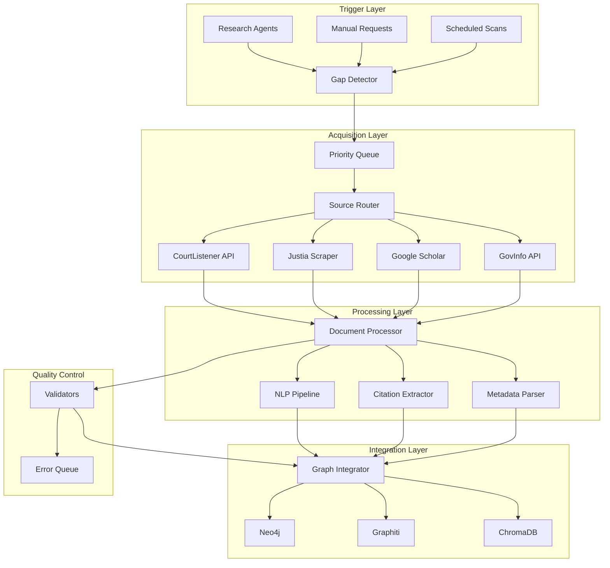
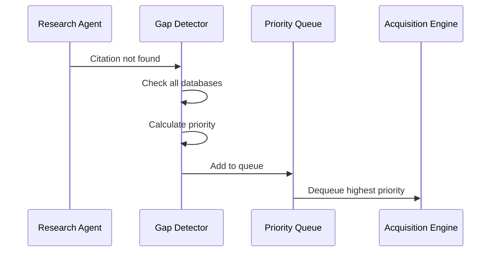
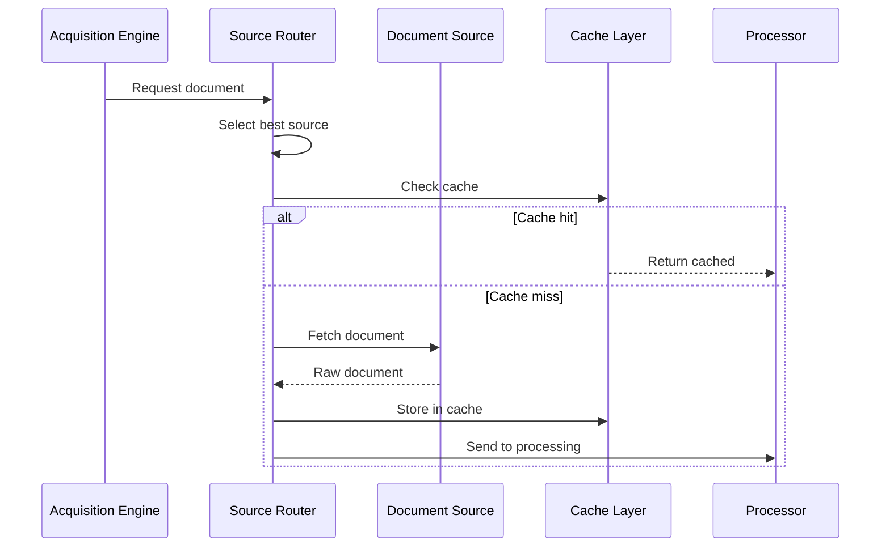
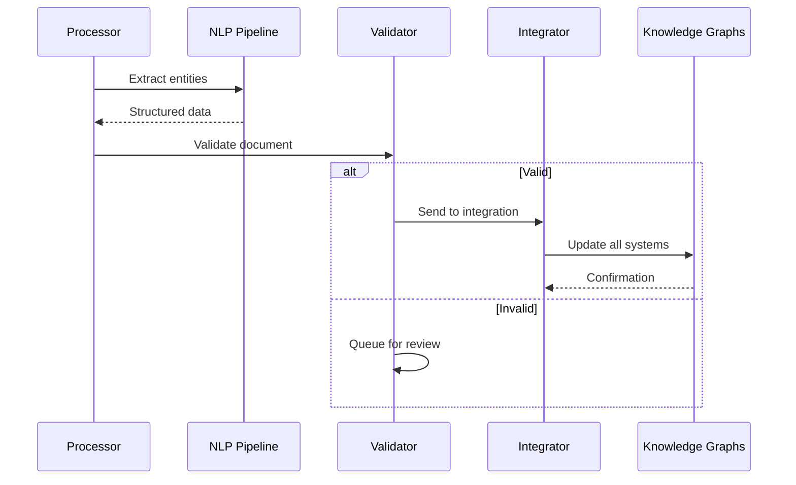

# Automated Legal Document Ingestion System Architecture

## Table of Contents
1. [Executive Summary](#executive-summary)
2. [System Overview](#system-overview)
3. [Architecture Principles](#architecture-principles)
4. [Component Architecture](#component-architecture)
5. [Data Flow Architecture](#data-flow-architecture)
6. [Integration Architecture](#integration-architecture)
7. [Scalability & Performance](#scalability--performance)
8. [Security & Compliance](#security--compliance)
9. [Monitoring & Observability](#monitoring--observability)
10. [Deployment Architecture](#deployment-architecture)

## Executive Summary

The Automated Legal Document Ingestion System is designed to continuously identify, acquire, process, and integrate legal documents (cases, statutes, regulations) into the Legal Research Platform's knowledge bases. The system operates autonomously, detecting gaps in the knowledge base during research operations and automatically filling those gaps from multiple sources.

### Key Capabilities
- **Automatic Gap Detection**: Identifies missing legal resources in real-time
- **Multi-Source Acquisition**: Fetches documents from free and authorized sources
- **Intelligent Processing**: Extracts structured data, citations, and legal concepts
- **Comprehensive Integration**: Updates Neo4j, Graphiti, and ChromaDB simultaneously
- **Quality Assurance**: Validates documents before integration
- **Scalable Architecture**: Handles thousands of documents daily

## System Overview



## Architecture Principles

### 1. Event-Driven Architecture
- **Asynchronous Processing**: All operations are non-blocking
- **Message Queues**: Decouple components for resilience
- **Event Sourcing**: Track all ingestion events for audit

### 2. Microservices Design
- **Service Isolation**: Each component runs independently
- **API-First**: All communication via well-defined APIs
- **Stateless Services**: Enable horizontal scaling

### 3. Fault Tolerance
- **Circuit Breakers**: Prevent cascade failures
- **Retry Logic**: Exponential backoff for transient failures
- **Dead Letter Queues**: Capture failed documents for manual review

### 4. Data Quality First
- **Multi-Stage Validation**: Ensure document integrity
- **Confidence Scoring**: Track reliability of sources
- **Human-in-the-Loop**: Flag low-confidence documents

## Component Architecture

### 1. Gap Detection Service

```yaml
Gap Detector:
  Responsibilities:
    - Monitor research queries for citations
    - Check existence in knowledge bases
    - Track citation request frequency
    - Calculate ingestion priority
  
  Interfaces:
    Input:
      - Research query citations
      - Manual ingestion requests
      - Scheduled scan results
    Output:
      - Missing resource records
      - Priority scores
      - Context metadata
  
  Storage:
    - Redis: Citation request tracking
    - PostgreSQL: Missing resource catalog
```

### 2. Document Acquisition Service

```yaml
Acquisition Engine:
  Components:
    Source Manager:
      - Source availability checker
      - Rate limit manager
      - Authentication handler
    
    Document Fetcher:
      - HTTP client with retries
      - PDF downloader
      - HTML parser
      - API response handler
    
    Cache Layer:
      - Document cache (24hr TTL)
      - Failed attempt tracking
  
  Source Adapters:
    - CourtListener (Federal cases)
    - Justia (Free legal database)
    - Google Scholar (Academic/legal)
    - GovInfo (Statutes/regulations)
    - Westlaw/Lexis (Premium, if available)
```

### 3. Document Processing Service

```yaml
Processing Pipeline:
  Stages:
    1. Format Detection:
       - PDF, HTML, Plain text, JSON
    
    2. Text Extraction:
       - OCR for scanned PDFs
       - HTML parsing
       - Encoding detection
    
    3. Structure Analysis:
       - Header/section detection
       - Opinion/dissent separation
       - Footnote extraction
    
    4. NLP Processing:
       - Legal NER (spaCy legal model)
       - Citation extraction
       - Holding identification
       - Summary generation
    
    5. Metadata Extraction:
       - Case name parsing
       - Court identification
       - Date extraction
       - Judge/attorney names
```

### 4. Knowledge Integration Service

```yaml
Integration Orchestrator:
  Neo4j Integration:
    - Create case nodes
    - Build citation edges
    - Update case metadata
    - Maintain citation network
  
  Graphiti Integration:
    - Create temporal episodes
    - Track ingestion events
    - Build legal concept relationships
    - Enable time-based queries
  
  ChromaDB Integration:
    - Generate embeddings
    - Chunk documents
    - Store with metadata
    - Enable semantic search
  
  Transaction Management:
    - Distributed transactions
    - Rollback on failure
    - Consistency verification
```

## Data Flow Architecture

### 1. Ingestion Trigger Flow



### 2. Document Acquisition Flow



### 3. Processing & Integration Flow



## Integration Architecture

### 1. Database Integration Pattern

```python
class TransactionalIntegrator:
    """Ensures atomic updates across all databases"""
    
    async def integrate_with_transaction(self, document):
        # Start distributed transaction
        neo4j_tx = await self.neo4j.begin_transaction()
        
        try:
            # Update Neo4j
            neo4j_id = await self.update_neo4j(document, neo4j_tx)
            
            # Update Graphiti (eventual consistency)
            graphiti_task = asyncio.create_task(
                self.update_graphiti(document)
            )
            
            # Update ChromaDB
            chroma_ids = await self.update_chroma(document)
            
            # Commit if all successful
            await neo4j_tx.commit()
            await graphiti_task
            
        except Exception as e:
            await neo4j_tx.rollback()
            raise IntegrationError(f"Failed to integrate: {e}")
```

### 2. Event Stream Architecture

```yaml
Event Topics:
  ingestion.requested:
    - Citation requested
    - Priority assigned
    - Context attached
  
  ingestion.started:
    - Source selected
    - Acquisition began
  
  ingestion.completed:
    - Document processed
    - Integration successful
    - Metrics recorded
  
  ingestion.failed:
    - Error details
    - Retry scheduled
    - Alert triggered
```

### 3. API Integration Points

```yaml
Internal APIs:
  Gap Detection API:
    POST /gaps/detect
    GET /gaps/pending
    PUT /gaps/{id}/priority
  
  Acquisition API:
    POST /acquire/document
    GET /acquire/status/{id}
    GET /sources/availability
  
  Processing API:
    POST /process/document
    GET /process/status/{id}
    GET /process/metrics

External APIs:
  CourtListener:
    - REST API v3
    - Rate limit: 30/min
    - Auth: API key
  
  GovInfo:
    - REST API
    - Rate limit: 60/min
    - Auth: None required
```

## Scalability & Performance

### 1. Horizontal Scaling Strategy

```yaml
Scalable Components:
  Gap Detector:
    - Stateless service
    - Scale based on query volume
    - Target: <100ms response
  
  Acquisition Workers:
    - Worker pool pattern
    - Scale based on queue depth
    - Target: 1000 docs/hour
  
  Processing Workers:
    - CPU-intensive workloads
    - Scale based on CPU usage
    - Target: 30 seconds/document
  
  Integration Workers:
    - I/O bound operations
    - Scale based on database load
    - Target: 5 seconds/document
```

### 2. Performance Optimization

```yaml
Caching Strategy:
  Document Cache:
    - Redis cluster
    - 24-hour TTL
    - LRU eviction
  
  Embedding Cache:
    - Local memory cache
    - Pre-computed embeddings
    - Lazy loading
  
  Metadata Cache:
    - PostgreSQL materialized views
    - Refresh every hour
    - Index optimization

Queue Management:
  Priority Queue:
    - Redis sorted sets
    - Score-based ordering
    - Automatic rebalancing
  
  Processing Queue:
    - RabbitMQ/Kafka
    - Persistent messages
    - Dead letter handling
```

### 3. Resource Management

```yaml
Resource Limits:
  Per Service:
    CPU: 2-4 cores
    Memory: 4-8 GB
    Disk: 100 GB
  
  Database Connections:
    Neo4j: Pool size 20
    PostgreSQL: Pool size 30
    Redis: Pool size 50
  
  API Rate Limits:
    Internal: 1000 req/min
    External: Per source limits
```

## Security & Compliance

### 1. Authentication & Authorization

```yaml
Service Authentication:
  Internal Services:
    - mTLS between services
    - Service mesh (Istio)
    - JWT for API calls
  
  External Sources:
    - API key management
    - OAuth where supported
    - Credential rotation

Access Control:
  RBAC Model:
    - Admin: Full access
    - Operator: Monitor & retry
    - System: Automated access
    - Auditor: Read-only logs
```

### 2. Data Security

```yaml
Encryption:
  In Transit:
    - TLS 1.3 minimum
    - Certificate pinning
    - Perfect forward secrecy
  
  At Rest:
    - Database encryption
    - File system encryption
    - Key management (HSM)

Data Handling:
  PII Protection:
    - Automatic redaction
    - Audit logging
    - Access tracking
  
  Legal Compliance:
    - Copyright tracking
    - Fair use documentation
    - Source attribution
```

### 3. Audit & Compliance

```yaml
Audit Trail:
  Events Tracked:
    - Document acquisition
    - Processing steps
    - Integration results
    - Access logs
  
  Retention:
    - Audit logs: 7 years
    - Error logs: 90 days
    - Metrics: 1 year

Compliance Features:
  - GDPR data handling
  - SOC 2 compliance
  - Legal hold support
  - Chain of custody
```

## Monitoring & Observability

### 1. Metrics Collection

```yaml
Key Metrics:
  Business Metrics:
    - Documents ingested/hour
    - Success rate by source
    - Gap fill rate
    - Cost per document
  
  Technical Metrics:
    - Queue depths
    - Processing latency
    - Error rates
    - API response times
  
  Quality Metrics:
    - Validation pass rate
    - Confidence scores
    - Manual review rate
    - Data completeness
```

### 2. Alerting Strategy

```yaml
Alert Levels:
  Critical:
    - Service down
    - Queue overflow
    - Database connection lost
    - Auth failures
  
  Warning:
    - High error rate (>5%)
    - Slow processing (>2x normal)
    - Source unavailable
    - Low confidence scores
  
  Info:
    - Daily summary
    - Source statistics
    - Cost tracking
    - Performance trends
```

### 3. Dashboards

```yaml
Operational Dashboard:
  Real-time Metrics:
    - Active ingestions
    - Queue status
    - Error rate
    - Source health
  
  Historical Trends:
    - Ingestion volume
    - Success rates
    - Performance graphs
    - Cost analysis

Quality Dashboard:
  Document Quality:
    - Validation results
    - Confidence distribution
    - Review queue depth
  
  Source Quality:
    - Source reliability
    - Data completeness
    - Error patterns
```

## Deployment Architecture

### 1. Container Architecture

```yaml
Container Images:
  Base Images:
    - Python 3.11 (processors)
    - Node.js 20 (API services)
    - Alpine Linux (minimal)
  
  Service Images:
    - gap-detector:latest
    - acquisition-engine:latest
    - document-processor:latest
    - graph-integrator:latest
    - quality-validator:latest
```

### 2. Kubernetes Deployment

```yaml
Kubernetes Resources:
  Deployments:
    - Stateless services
    - Auto-scaling enabled
    - Health checks
    - Resource limits
  
  Services:
    - Load balancing
    - Service discovery
    - Internal DNS
  
  ConfigMaps:
    - Service configuration
    - Source credentials
    - Feature flags
  
  Secrets:
    - API keys
    - Database passwords
    - TLS certificates
```

### 3. Infrastructure Requirements

```yaml
Production Environment:
  Compute:
    - 10-20 pods minimum
    - Auto-scaling to 50 pods
    - 100 CPU cores total
    - 200 GB RAM total
  
  Storage:
    - 5 TB document cache
    - 1 TB database storage
    - 500 GB log storage
  
  Network:
    - 10 Gbps internal
    - 1 Gbps external
    - CDN for static content

Development Environment:
  - Docker Compose setup
  - Local Kubernetes (k3s)
  - Mock external services
  - Sample document sets
```

## Conclusion

The Automated Legal Document Ingestion System provides a robust, scalable architecture for continuously building and maintaining a comprehensive legal knowledge base. The event-driven, microservices design ensures reliability and performance while maintaining high data quality standards.

Key architectural benefits:
- **Autonomous Operation**: Minimal manual intervention required
- **Multi-Source Resilience**: No single point of failure
- **Quality Assurance**: Multiple validation stages
- **Scalable Design**: Handles growth in document volume
- **Observable System**: Comprehensive monitoring and alerting

The architecture supports the Legal Research Platform's goal of providing comprehensive, up-to-date legal information while respecting source limitations and maintaining data quality.